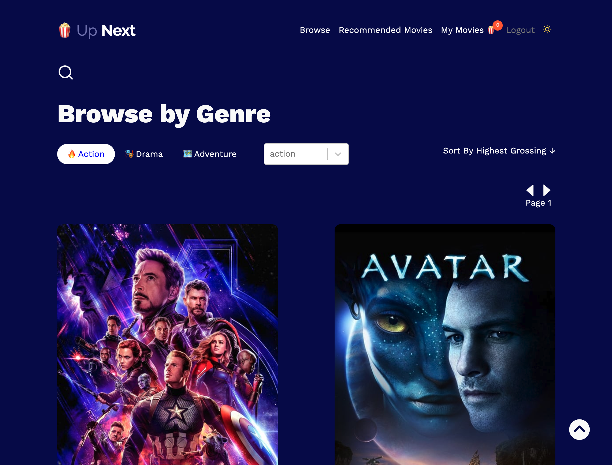
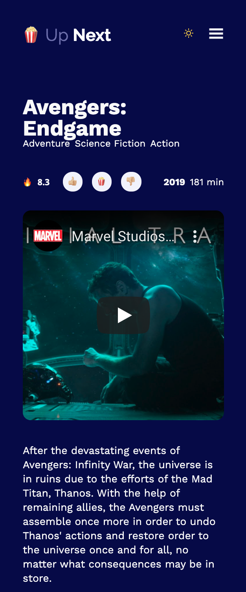
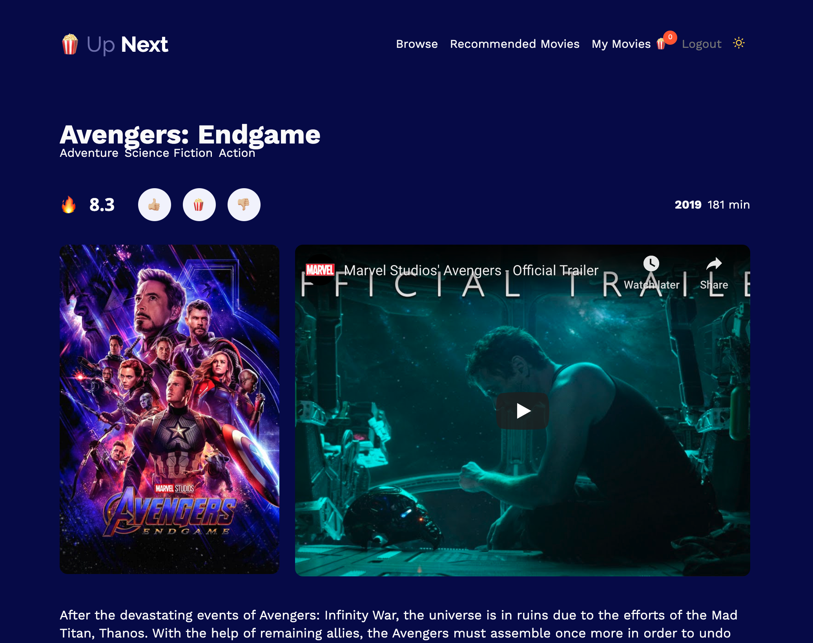
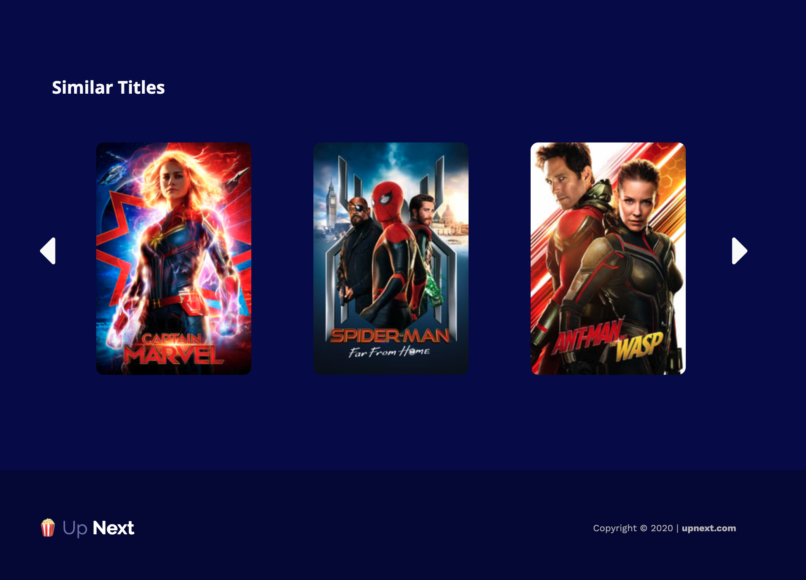
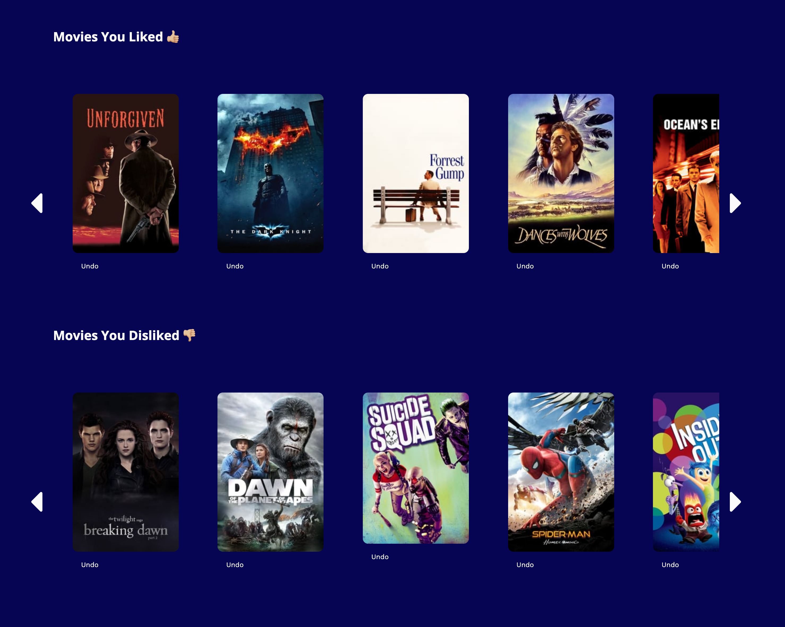
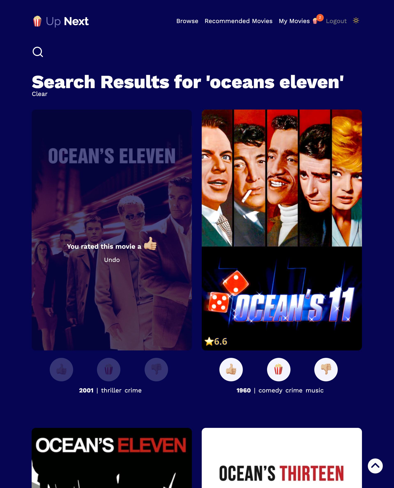

# up-next-app

A movie-rating app that allows users to find movies, rate movies, and get recommendations. Users can also create an "up next" list as they browse. 

Check out the demo here: https://youtu.be/WTwF6PsplUs

## Built With

* ReactJS
* Firebase
* NodeJs

## Notes 
Due to server limitations on Heroku, the live version does not include the ability to get recommendations yet, though it is possible to achieve locally. 

Check out the demo here: https://youtu.be/WTwF6PsplUs

## Acknowledgments

* For the recommender system I used the machine learning algorithm found here: https://github.com/mattdm3/movielens-recommender-system-javascript
* All movie information is taken from https://www.themoviedb.org/


## Instructions
To get this app running locally, follow these steps: 

### Open two terminals, in the first terminal: 

```javascript
git clone https://github.com/mattdm3/up-next-project.git

cd up-next-project/

cd server/ 

yarn install

yarn start
```

### Second terminal: 

```javascript
cd up-next-project/

cd client/ 

yarn install

yarn start
```


## Screenshots

### browse page (day mode)


### browse page (night mode)


### browse on mobile


### Movie Page


### Movie Page showing similar titles


### Profile Page


### Profile Page (next section)


### Recommendations Page


### Search Page


